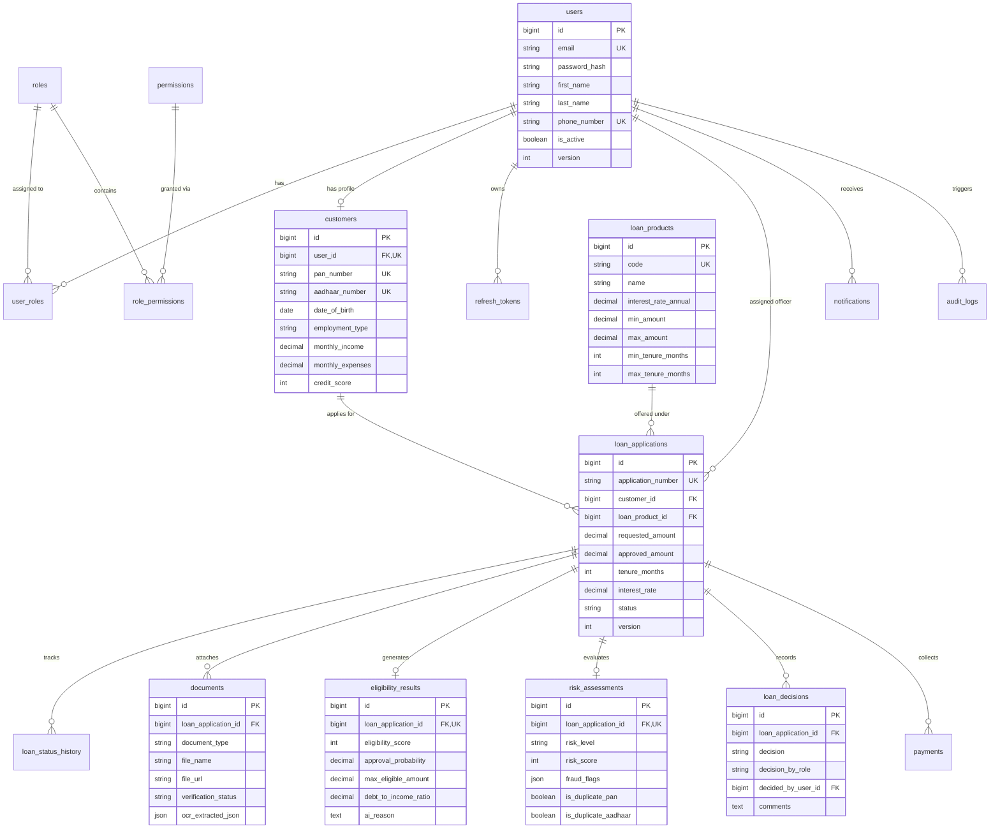

# LoanFlow Database ER Diagram

## Mermaid Visual Representation

```mermaid
erDiagram
    users ||--o{ user_roles : "has"
    roles ||--o{ user_roles : "assigned to"
    roles ||--o{ role_permissions : "contains"
    permissions ||--o{ role_permissions : "granted via"
    users ||--o| customers : "has profile"
    users ||--o{ refresh_tokens : "owns"
    
    customers ||--o{ loan_applications : "applies for"
    loan_products ||--o{ loan_applications : "offered under"
    users ||--o{ loan_applications : "assigned officer"
    
    loan_applications ||--o{ loan_status_history : "tracks"
    loan_applications ||--o{ documents : "attaches"
    loan_applications ||--o| eligibility_results : "generates"
    loan_applications ||--o| risk_assessments : "evaluates"
    loan_applications ||--o{ loan_decisions : "records"
    loan_applications ||--o{ payments : "collects"
    
    users ||--o{ notifications : "receives"
    users ||--o{ audit_logs : "triggers"

    users {
        bigint id PK
        string email UK
        string password_hash
        string first_name
        string last_name
        string phone_number UK
        boolean is_active
        int version
    }

    customers {
        bigint id PK
        bigint user_id FK,UK
        string pan_number UK
        string aadhaar_number UK
        date date_of_birth
        string employment_type
        decimal monthly_income
        decimal monthly_expenses
        int credit_score
    }

    loan_products {
        bigint id PK
        string code UK
        string name
        decimal interest_rate_annual
        decimal min_amount
        decimal max_amount
        int min_tenure_months
        int max_tenure_months
    }

    loan_applications {
        bigint id PK
        string application_number UK
        bigint customer_id FK
        bigint loan_product_id FK
        decimal requested_amount
        decimal approved_amount
        int tenure_months
        decimal interest_rate
        string status
        int version
    }

    documents {
        bigint id PK
        bigint loan_application_id FK
        string document_type
        string file_name
        string file_url
        string verification_status
        json ocr_extracted_json
    }

    eligibility_results {
        bigint id PK
        bigint loan_application_id FK,UK
        int eligibility_score
        decimal approval_probability
        decimal max_eligible_amount
        decimal debt_to_income_ratio
        text ai_reason
    }

    risk_assessments {
        bigint id PK
        bigint loan_application_id FK,UK
        string risk_level
        int risk_score
        json fraud_flags
        boolean is_duplicate_pan
        boolean is_duplicate_aadhaar
    }

    loan_decisions {
        bigint id PK
        bigint loan_application_id FK
        string decision
        string decision_by_role
        bigint decided_by_user_id FK
        text comments
    }
```
